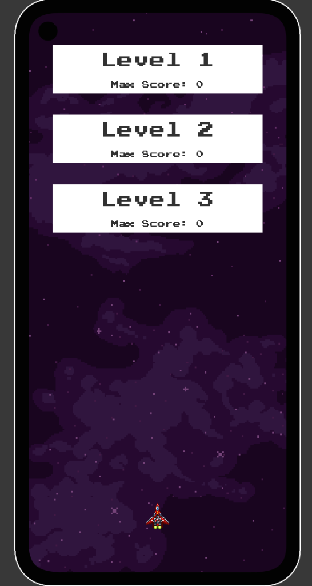
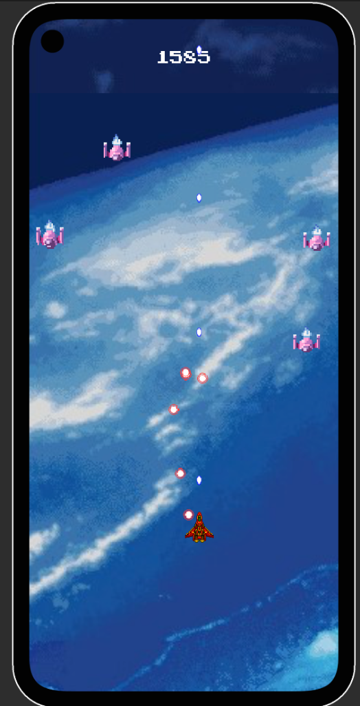
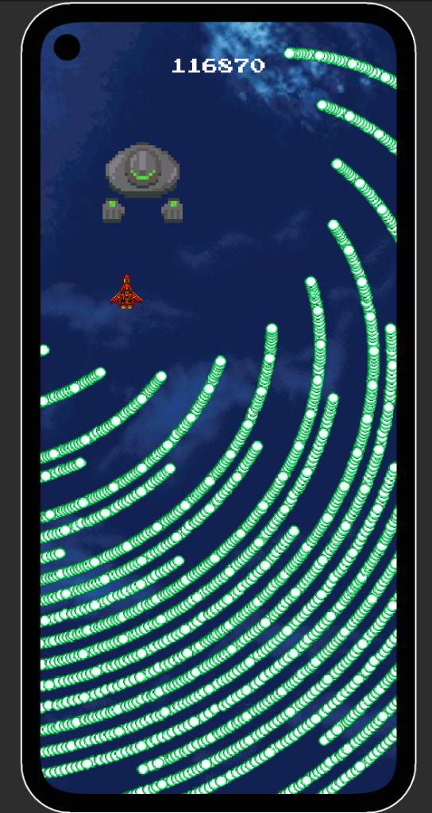
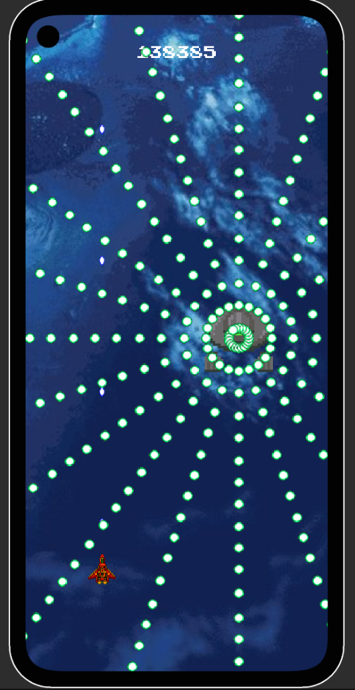
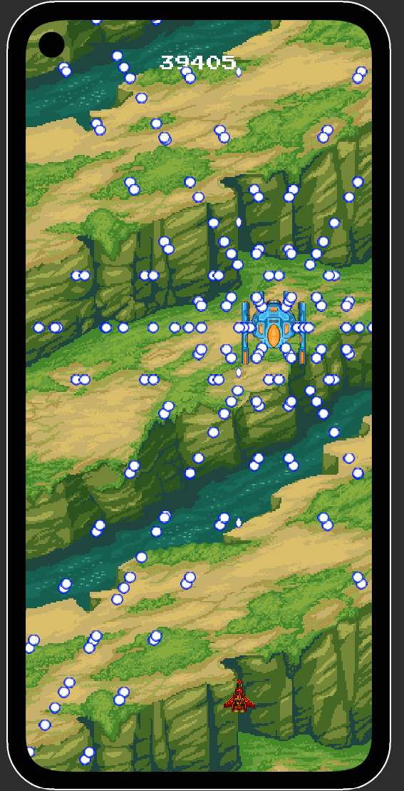

# Danmaku Bullet Hell

A high-performance Danmaku Bullet Hell game built in Unity, featuring massive bullet counts, complex patterns, and GPU-accelerated rendering.

## Overview

This project demonstrates a robust Bullet Hell framework capable of rendering and updating thousands of bullets simultaneously. It includes a wave-based level system, various enemy types, and a player with upgradeable power-ups.

## Features

-   **High-Performance Bullet System**: Utilizing Compute Shaders and GPU Instancing to handle 10,000+ bullets with high frame rates.
-   **Complex Patterns**: Support for diverse bullet patterns including spirals, circles, and aimed shots.
-   **Wave System**: ScriptableObject-based level data defining background, soundtrack, and enemy waves.
-   **Power-ups**: Collectible items to heal the player and increase bullet damage.
-   **Input System**: Modern Unity Input System support for mobile and desktop environments.

## Visuals

| Gameplay | Boss Pattern |
|----------|--------------|
|  |  |

 |  |

## Controls

-   **Movement**: `Touch Screen` (Mobile), `Touchpad`, or `Mouse Drag`.
-   **Shooting**: Automatic.

## Technical Details

### Bullet System
The core of this project is the `BulletSystem`, designed for extreme performance:
-   **Compute Shaders**: All bullet movement, lifetime management, and collision checks against the player are calculated on the GPU via `BulletCompute.compute` (referenced in `BulletSystem.cs`).
-   **GPU Instancing**: The `GPUInstanceBatch.cs` script uses `Graphics.DrawMeshInstancedIndirect` to render all bullets in a single draw call, bypassing the overhead of GameObjects.
-   **Shared Data**: A `BulletData` struct is shared between C# and HLSL to maintain state synchronization.

### Project Structure
-   **Assets/Framework**: Contains core systems like `Gameplay`, `Level`, `Enemies`, and `EnemyData`.
-   **Assets/Game**: Contains game-specific content including `Scenes`, `Shared` resources (Prefabs, Sprites, Scripts).

## Installation

1.  Open the project in **Unity 6000.2.9f1** or later.
2.  Open the `Assets/Game/Scenes/MainMenu` scene.
3.  Press **Play** to start the game.

## License

This project is for educational and portfolio purposes.
